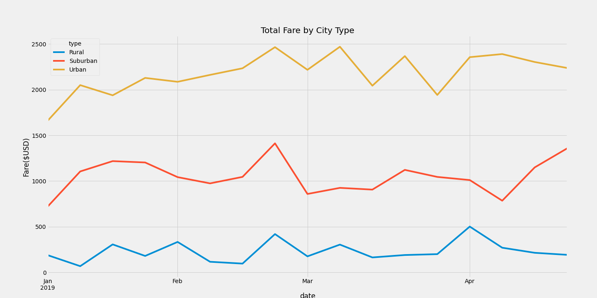

# PyBer Analysis

## Overview of Project

In order to summarize how our data differs by city type and understand how those differences can by used by decsion makers at PyBer we are assigned to use Python and Pandas to create a summary DataFrame of the ride sharing data by city type. Followed by using Matplotlib to create a miltiple-line graph that shows the total weekly fares for each city type.

## Results
1. Total number of rides for each city type: 
    * Rural: 125
    * Suburban: 625
    * Urban: 1625
2. Total number of drivers for each city type: 
    * Rural: 78
    * Suburban: 490
    * Urban: 2405
3. Sum of the fares for each city type:
    * Rural: $4,327.93
    * Suburban: $19,356.33
    * Urban: $39,854.38
4. Average fare per ride for each city type: 
    * Rural: $34.62
    * Suburban: $30.97
    * Urban: $24.53
5. Average fare per driver for each city type: 
    * Rural: $55.49
    * Suburban: $39.50
    * Urban: $16.57

Chart below illustrates the total weekly fares for each type of city. 

## Summary 
* Rural cities have the lowest number of rides, drivers and fares, but the highest average fare per ride and per driver. 
* Urban cities have the highest number of rides, drivers and fares, but the lowest average fare per ride and per driver. 
* Rural total fares started at about $200 in January and then increased and decreased for the next three month, ending at about the same $200 in April. 
* Suburban total fares started at about $750 in January and reached a high of about $1,400 in early March and then decreasing in April to about $750 again. Total fares began to rise again towards the $1,400 at the end of April. 
* Urban total fares started at about $1,600 in January and a high of about $2,400 in March. Total fares continued to decrease and increase until the end of April where they became to slowly decrease again.

Based on the results, I would suggest the following to PyBer for each city type: 
1.  In Rural cities, consider increasing the number of drivers to lower the average fare per ride and potentially get more rides from these cities. 
2. In Suburban cities, consider decreasing the number of drivers to increase the fare per driver. Some of these drivers can be moved to service rural areas to balance rural and suburban areas out. 
3. In Urban cities, there is a larger use for PyBer services, but the avergae far per driver is the lowest. Reassigning some of these drivers to the rural citites can potentially increase the fares for the drivers. 